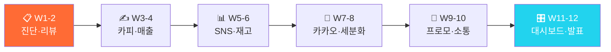

<div align="center">

# 🍽️ F&B AX 마스터클래스

### "AI로 배달·홀 매출을 동시에 올리는 12주 F&B 자동화 과정"

**리뷰분석부터 재고예측까지 — 가게 데이터로 직접 검증**

[](https://github.com/Reasonofmoon/hexa-2)
[](https://github.com/Reasonofmoon/hexa-2/tree/main/notebooks)
[](https://github.com/Reasonofmoon/hexa-2)
[](https://aistudio.google.com/)
[](LICENSE)

> **"배달앱 리뷰를 매일 읽고 답글 다는데 하루 1~2시간이 간다." 이 과정이 끝나면 AI가 대신합니다.**

[🚀 W1 바로 시작](https://colab.research.google.com/github/Reasonofmoon/hexa-2/blob/main/notebooks/W01_FnB_AX_diagnosis.ipynb) · [📂 전체 노트북](notebooks/) · [🔧 CLI 스크립트](scripts/) · [🐛 이슈](../../issues)

</div>

---

## 🧠 Philosophy — "왜 F&B / 외식업 AX인가"

기존 AI 교육의 문제: **이론만 있고 현장 데이터가 없다**.

| 기준 | 기존 AI 교육 | F&B AX 마스터클래스 |
|------|-------------|---|
| 데이터 | 가상의 샘플 데이터 | **F&B / 외식업 현장 CSV** |
| 결과물 | 모델 정확도 숫자 | **경영진 보고서 + 자동화 파이프라인** |
| 난이도 | Python 필수 | **Colab 실행만으로 완성** |
| 기간 | 3개월+ 이론 | **W1부터 당일 실전 결과** |
| 연결성 | 개별 실습 | **W1→W12 자동화 파이프라인** |



---

## ⚙️ 12주 커리큘럼

### Layer 1 · Foundation (W1~W4) — AI 기초 도구화

> **Wow**: 배달앱 저점수 리뷰 자동 분류 → 맞춤 답글 **3초** 생성

| 주차 | 주제 | 핵심 출력물 | Colab |
|----|------|------------|-------|
| **W1** | F&B AX 자가진단 | 10항목 레이더 · 맞춤 개선 로드맵 | [](https://colab.research.google.com/github/Reasonofmoon/hexa-2/blob/main/notebooks/W01_FnB_AX_diagnosis.ipynb) |
| **W2** | 배달앱 리뷰 감성분석 | 감성분류(긍정/부정) · 저점수 자동 답글 생성 | [](https://colab.research.google.com/github/Reasonofmoon/hexa-2/blob/main/notebooks/W02_FnB_review_analyzer.ipynb) |
| **W3** | 메뉴 카피라이팅 | 배달앱 설명 80자 · 인스타 캡션 ZIP | [](https://colab.research.google.com/github/Reasonofmoon/hexa-2/blob/main/notebooks/W03_FnB_menu_copy.ipynb) |
| **W4** | 채널별 매출 분석 | 채널 KPI 막대그래프 · Gemini 전략 보고서 | [](https://colab.research.google.com/github/Reasonofmoon/hexa-2/blob/main/notebooks/W04_FnB_sales_analysis.ipynb) |

### Layer 2 · Analytics (W5~W8) — 데이터 기반 의사결정

> **Wow**: 30일치 매출 데이터로 **클릭 한 번**에 채널별 KPI 차트

| 주차 | 주제 | 핵심 출력물 | Colab |
|----|------|------------|-------|
| **W5** | SNS 콘텐츠 자동화 | 인스타·카카오 게시글 5종 자동 생성 | [](https://colab.research.google.com/github/Reasonofmoon/hexa-2/blob/main/notebooks/W05_FnB_sns_content.ipynb) |
| **W6** | 식자재 재고 예측 | 부족 식자재 감지 · 발주 메시지 자동 생성 | [](https://colab.research.google.com/github/Reasonofmoon/hexa-2/blob/main/notebooks/W06_FnB_inventory_forecast.ipynb) |
| **W7** | 카카오 알림 자동화 | 이벤트·프리미엄 알림 문구 자동 생성 | [](https://colab.research.google.com/github/Reasonofmoon/hexa-2/blob/main/notebooks/W07_FnB_kakao_notify.ipynb) |
| **W8** | 고객 세분화 RFM | VIP·일반·이탈위험 3분류 · 세그먼트 차트 | [](https://colab.research.google.com/github/Reasonofmoon/hexa-2/blob/main/notebooks/W08_FnB_customer_segment.ipynb) |

### Layer 3 · Intelligence (W9~W12) — 자동화 운영 시스템

> **Wow**: 재고 부족 식자재 자동 감지 → 공급업체 발주 문자 **즉시** 생성

| 주차 | 주제 | 핵심 출력물 | Colab |
|----|------|------------|-------|
| **W9** | 프로모션 기획 | 시즌별 이벤트 5종 · 예산·타겟 설계 | [](https://colab.research.google.com/github/Reasonofmoon/hexa-2/blob/main/notebooks/W09_FnB_promotion.ipynb) |
| **W10** | 공급업체 소통 | 이슈별 공문 3종 · ZIP 자동 생성 | [](https://colab.research.google.com/github/Reasonofmoon/hexa-2/blob/main/notebooks/W10_FnB_vendor_comm.ipynb) |
| **W11** | F&B 종합 대시보드 | 매출·리뷰·재고 4패널 · AI 인사이트 | [](https://colab.research.google.com/github/Reasonofmoon/hexa-2/blob/main/notebooks/W11_FnB_dashboard.ipynb) |
| **W12** | 12주 성과 Cockpit | 도입전후 KPI 비교 · 경영진 보고서 | [](https://colab.research.google.com/github/Reasonofmoon/hexa-2/blob/main/notebooks/W12_FnB_cockpit.ipynb) |

---

## 🎯 수준별 활용 가이드

### 🟢 Starter — "5분 안에 첫 AI 결과"
> AX 진단점수 10~24점 · 코딩 경험 없음

1. [W1 노트북](https://colab.research.google.com/github/Reasonofmoon/hexa-2/blob/main/notebooks/W01_FnB_AX_diagnosis.ipynb) 클릭 → Google Colab에서 열기
2. `GEMINI_API_KEY` 입력 ([발급](https://aistudio.google.com/apikey))
3. 가게명·플랫폼 입력 → 자가진단 레이더 차트 즉시 생성
4. `Ctrl+F9` (전체 실행) → 결과 자동 다운로드

### 🔵 Professional — "실제 데이터로 실전 분석"
> AX 진단점수 25~39점 · 기초 Excel 가능

1. `shared/fnb_sales_sample.csv` 구조 확인
2. 배달앱 리뷰 CSV 업로드 → 감성분류 + 자동 답글 생성
3. W7~W8에서 Slack/Sheets 연결
4. W9~W10으로 이상감지·소통 자동화 구축

### 🟣 Enterprise — "12주 파이프라인 & 팀 표준화"
> AX 진단점수 40~50점 · 자동화 확장 목표

1. W11 대시보드 → 채널별 KPI 실시간 모니터링 팀 공유
2. W12 보고서를 정기 자동화 스케줄로 전환
3. 다른 hexa 시리즈와 교차 벤치마킹

---

## 🔧 확장 우선순위

| 우선순위 | 커스터마이징 | 난이도 | 영향 범위 |
|----------|--------------|--------|----------|
| **1st** | 가게 정보 딕셔너리 수정 | ⭐ | 이름·플랫폼·메뉴 |
| **2nd** | 리뷰 CSV 실제 데이터 교체 | ⭐⭐ | 분석 결과 |
| **3rd** | 카카오 API 연결 | ⭐⭐ | 실시간 알림 |
| **4th** | Sheets 매출 연동 | ⭐⭐⭐ | 경영 대시보드 |
| **5th** | W11~W12 서버 배포 | ⭐⭐⭐ | 팀 공유 시스템 |

---

## 📂 프로젝트 구조

```
hexa-2/
├── notebooks/          ← 12주 Colab 실습 노트북 (W01~W12)
│   ├── W01_FnB_AX_diagnosis.ipynb                    # W1: F&B AX 자가진단
│   ├── W02_FnB_review_analyzer.ipynb                 # W2: 배달앱 리뷰 감성분석
│   ├── W03_FnB_menu_copy.ipynb                       # W3: 메뉴 카피라이팅
│   ├── W04_FnB_sales_analysis.ipynb                  # W4: 채널별 매출 분석
│   ├── W05_FnB_sns_content.ipynb                     # W5: SNS 콘텐츠 자동화
│   ├── W06_FnB_inventory_forecast.ipynb              # W6: 식자재 재고 예측
│   ├── W07_FnB_kakao_notify.ipynb                    # W7: 카카오 알림 자동화
│   ├── W08_FnB_customer_segment.ipynb                # W8: 고객 세분화 RFM
│   ├── W09_FnB_promotion.ipynb                       # W9: 프로모션 기획
│   ├── W10_FnB_vendor_comm.ipynb                     # W10: 공급업체 소통
│   ├── W11_FnB_dashboard.ipynb                       # W11: F&B 종합 대시보드
│   ├── W12_FnB_cockpit.ipynb                         # W12: 12주 성과 Cockpit
├── scripts/            ← CLI Python 스크립트 (리뷰분석 · 메뉴카피 · 재고알림)
├── shared/             ← 실습 데이터 (fnb_sales_sample.csv)
└── labs/               ← 보조 실습 가이드
```

---

## 🚀 빠른 시작

```bash
git clone https://github.com/Reasonofmoon/hexa-2.git && cd hexa-2
pip install google-generativeai pandas matplotlib numpy  # 로컬 실행 시
```

[](https://colab.research.google.com/github/Reasonofmoon/hexa-2/blob/main/notebooks/W01_FnB_AX_diagnosis.ipynb)
[](https://colab.research.google.com/github/Reasonofmoon/hexa-2/blob/main/notebooks/W02_FnB_review_analyzer.ipynb)
[](https://colab.research.google.com/github/Reasonofmoon/hexa-2/blob/main/notebooks/W03_FnB_menu_copy.ipynb)
[](https://colab.research.google.com/github/Reasonofmoon/hexa-2/blob/main/notebooks/W04_FnB_sales_analysis.ipynb)

---

## 🔗 전체 AX 시리즈 (hexa-1~6)

| 레포 | 섹터 | 핵심 AI 자동화 | 링크 |
|------|------|--------------|------|
| **hexa-1** | 🏭 제조업 | 불량분류·OEE·예지보전 | [→](https://github.com/Reasonofmoon/hexa-1) |
| **hexa-2** (현재) | 🍽️ F&B | 리뷰분석·메뉴카피·재고예측 | — |
| **hexa-3** | 🛒 소매/이커머스 | 상품카피·CRM·SEO분석 | [→](https://github.com/Reasonofmoon/hexa-3) |
| **hexa-4** | 📚 교육/학원 | 교안자동화·성적분석·챗봇 | [→](https://github.com/Reasonofmoon/hexa-4) |
| **hexa-5** | 🏗️ 건설/시공 | 계약서·공정KPI·안전점검 | [→](https://github.com/Reasonofmoon/hexa-5) |
| **hexa-6** | 💼 IT서비스 | 제안서·코드리뷰·인시던트 | [→](https://github.com/Reasonofmoon/hexa-6) |

---

## 🌐 다국어 지원

| 항목 | 현황 |
|------|------|
| 노트북 UI | 🇰🇷 한국어 |
| 스크립트 출력 | 한국어 (컬럼 한/영 자동감지) |
| 샘플 데이터 | 한국어 컬럼명 |
| README | 한국어 / English (예정) |

---

*AX Consulting Curriculum © 2026 | Powered by Google Gemini 2.0 Flash*
